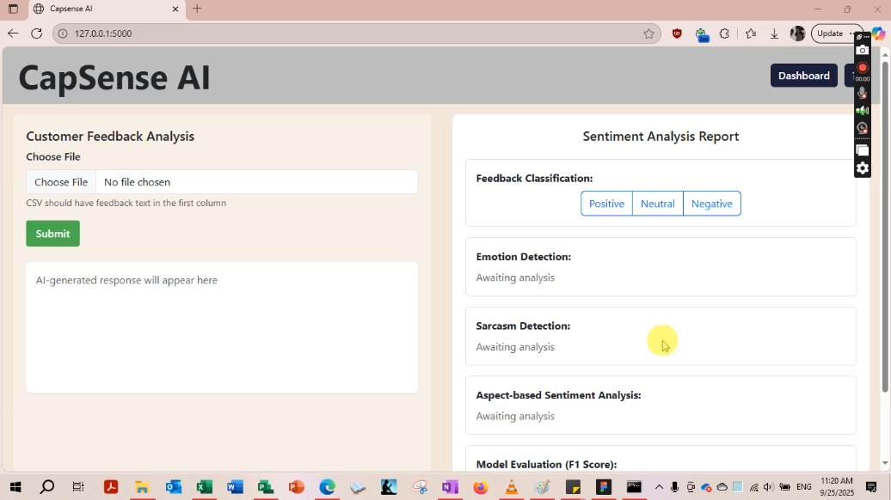

# CapSense AI – Sentiment Analysis and Response Generation Application

**Developed for Capgemini** – As a team of developers, testers, and technical writers we developed CapSense AI in response to a customer-service problem and use case provided by Capgemini, the industry sponsor for our capstone project. The system was developed to reduce hours of daily manual analysis of customer feedback and providing timely responses empathetically of from various channels which is time-consuming and prone to human error.
**Impact:** Generated editable AI-powered responses with the potential to reduce customer support teams’ manual workload by approximately 80%.
See our original group repo here: https://github.com/CapSense/Capgemini_SentimentApp_Remake.

---
**Post-capstone edits to UI design 2026:**


## Overview

CapSense AI is an AI-powered Sentiment Analysis and Response Generation application designed to revolutionize customer service by analyzing customer feedback and generating empathetic, brand-aligned responses.

The system leverages machine learning for sentiment and emotion detection, sarcasm identification, and integrates advanced language models (OpenAI, then Phi-3, later Phi-4) to generate personalized responses. It enables batch processing of feedback, providing actionable insights and automating routine tasks while maintaining a consistent brand voice.

Our project showcases full-stack development, AI model integration, classifier model training, and practical experience deploying enterprise-grade applications on Microsoft Azure.

---
## How It Works

**▶ Watch the demo of the sentiment analysis and response generation features**
[](https://drive.google.com/file/d/1hLhfb_w8bMp3_GzqWgtKudcqmytcW8Lk/view?usp=sharing)

As the above video demonstrates, CapSense AI uses a React and TypeScript frontend to collect customer feedback through text input or CSV uploads. The frontend communicates with a Python Flask backend through REST APIs, where feedback is processed through sentiment, emotion, sarcasm, and aspect-based analysis. For instance, my custom Naïve Bayes classifier handles emotion detection, and a teammate's classifier model handles sarcasm detection, while Azure-hosted Phi models generate context-aware, empathetic responses. Results are returned to the frontend for visualization in an interactive sentiment analysis report and dashboard. The application and supporting services are deployed using Microsoft Azure.

## My Contributions

- **Frontend Development**  
  Built the responsive and interactive React frontend using Vite. Implemented:
  - Text input and CSV file upload for single and batch feedback.
  - Modular Sentiment Analysis Report UI with components for sentiment, emotion, sarcasm, aspect-based sentiment, and AI-generated responses.
  - State management, API integration with Axios, and conditional rendering to handle asynchronous backend responses.

- **Phi Model Integration**  
  - Initially integrated **Phi-3 Mini** model via Azure AI Studio for context-aware, empathetic response generation.  
  - Updated payload format from OpenAI-style requests to Phi-compatible requests.  
  - Later upgraded to **Phi-4**, ensuring seamless response generation and fallback mechanisms.

- **Emotion Detection Model**  
  - Built and trained a **Naïve Bayes classifier** from scratch using 42,000+ customer feedback entries.  
  - Achieved **55.81% accuracy** across six primary emotions (anger, joy, anticipation, neutral, disgust, sadness).  
  - Integrated the model into the Flask backend for real-time emotion classification.

- **Backend Integration & Deployment Support**  
  - Configured Flask APIs for batch and single-feedback processing.  
  - Assisted in deploying the backend on **Azure Virtual Machines**, ensuring proper environment setup, port configuration, and database connectivity.  
  - Helped debug server errors, install dependencies (e.g., NLTK), and ensure classifier functionality.

---

## Technologies Used

- **Frontend:** React, Vite, TypeScript, Bootstrap, Chart.js, Axios
- **Backend:** Python, Flask, Naïve Bayes (scikit-learn), NLTK, Hugging Face Transformers
- **AI Models:** OpenAI's GPT, Phi-3 Mini, Phi-4 (Azure AI Studio via API),
- **Database:** Azure SQL, pyodbc
- **Deployment & Infrastructure:** Microsoft Azure App Service, Azure VM, Azure AI Studio
- **Other Tools:** GitHub, GitHub Actions (CI/CD), Putty, WinSCP

---

## Key Features

- Sentiment Classification: Positive, Negative, Neutral  
- Emotion Detection: Anger, Joy, Fear, Disgust, Sadness  
- Sarcasm Detection  
- AI-Generated Empathetic Responses via Phi models  
- Aspect-Based Sentiment Analysis  
- Batch Processing of CSV Feedback Files  
- Dashboard for visualization

---

## Installation & Usage

**Prerequisites:** Python 3.x, npm, Git, IDE (VS Code or PyCharm), Microsoft Azure/Azure AI Foundry and the required Azure/AI credentials and environment variables.

1. **Clone the repository**
```bash
git clone <repo-url>
cd capsense-ai
```

2. **Install backend dependencies**
```bash
pip install -r requirements.txt
```

3. **Install frontend dependencies**
```bash
cd frontend
npm install
```

4. **Set environment variables**
```bash
PHI3_KEY=<your-phi3-key>
PHI3_ENDPOINT=<your-phi3-endpoint>
```

5. **Run Backend**
```bash
python app.py
```

6. **Run Frontend**
```bash
npm run dev
```

7. **Access the application** via browser at `http://localhost:3000`

---

## Key Achievements

- Developed a complete **full-stack AI application** handling both frontend and backend integration.  
- Built a **custom Naïve Bayes emotion classifier** from scratch, achieving strong interpretability without relying on heavy transformers.  
- Integrated **Phi-3 and Phi-4 models** for dynamic, context-aware response generation.  
- Successfully deployed the system on **Azure Virtual Machines**, demonstrating cloud deployment and environment management skills.  
- Collaborated effectively with a team while resolving deployment and integration challenges.

---

## References

- Capgemini – Enterprise-grade sentiment analysis needs and branding requirements  
- Azure AI Studio Documentation – Phi Models  
- Scikit-learn & NLTK – Machine learning and natural language processing  
- React & Vite – Frontend development framework and bundler

---

## Testing & User Documentation
- [User Documentation](CapSense User Documentation.docx) – Instructions for using the application.
- [Testing Report](Comprehensive Testing Report.docs) – Detailed testing procedures, test cases, and results.

---

**CapSense AI** reflects my hands-on experience in **full-stack development, machine learning, NLP, AI model integration, and cloud deployment**, that gave me exposure to professional work and real technical experience.

